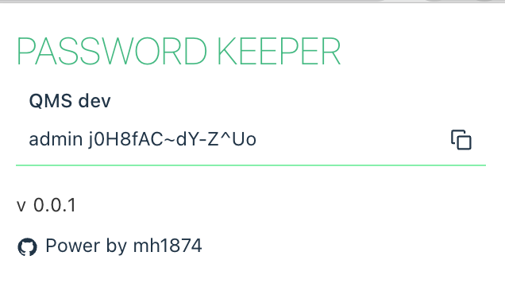

# Create Chrome Extension



## Installing

> Node >= 14.18.0

```bash
# use npm | pnpm | yarn
λ npm install

# build
λ npm run build

```

## Testing locally on Chrome

In order to test the package holding the extension in Chrome we need to:

1. Go to `chrome://extensions/` page.
2. Toggle `Developer mode` ON.
3. Select `Load Unpacked`.
4. Select the `/build` directory.

[reference document](https://github.com/guocaoyi/create-chrome-ext/tree/main/template-vue-ts)
